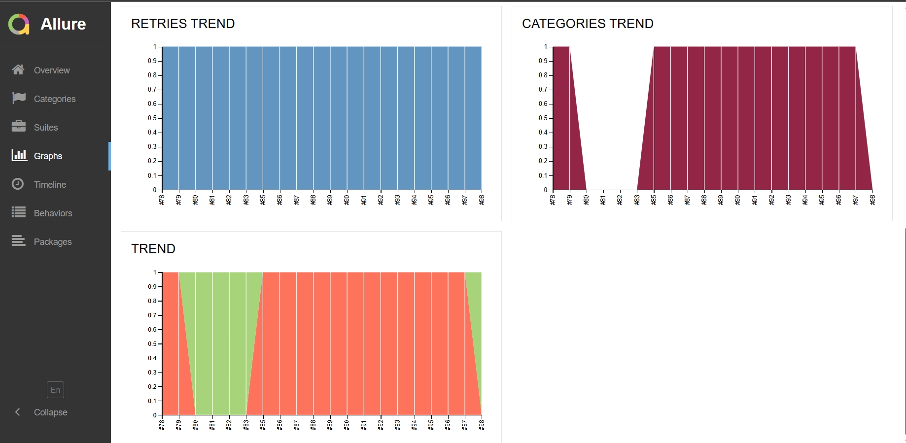

# QA Auto project (Vantage) for [ABBYY](https://www.abbyy.com/vantage/)

> ABBYY Intelligent Process Automation combines process mining with Intelligent Document Processing to help you transform enterprise data and get the insights you need to improve process efficiency and effectiveness.

## **Contains:**
____

* <a href="#tools">Technologies and tools</a>

* <a href="#cases">Examples of automated test-cases</a>

* <a href="#jenkins">Build in Jenkins</a>

* <a href="#console">Launch from Terminal</a>

* <a href="#allure">Allure report</a>

* <a href="#video">Test execution in Selenoid (video)</a>
____
<a id="tools"></a>
## <a name="Technologies and tools">**Technologies and tools:**</a>

<p align="center">  
<a href="https://www.jetbrains.com/idea/"></a>  
<a href="https://www.java.com/"></a>  
<a href="https://github.com/"></a>  
<a href="https://junit.org/junit5/"></a>  
<a href="https://gradle.org/"></a>  
<a href="https://selenide.org/"></a>  
<a href="https://aerokube.com/selenoid/"></a>  
<a href="ht[images](images)tps://github.com/allure-framework/allure2"></a>   
<a href="https://www.jenkins.io/"></a>  
</p>

____
<a id="cases"></a>
## <a name="Examples of automated test-cases">**Examples of automated test-cases:**</a>
____
- ✓ *Check that main buttons are working*
- ✓ *Check that "contact us" form is working*
____
<a id="jenkins"></a>
## </a><a name="Build"></a>Build in [Jenkins](https://jenkins.autotests.cloud/job/VRBorchevskiy-qa_guru_20_jenkins_remote/)</a>
____
<p align="center">  
<a href="https://jenkins.autotests.cloud/job/VRBorchevskiy-qa_guru_20_jenkins_remote"></a>  
</p>


### **Configuration in Jenkins:**

- *baseUrl (address of tested web page)*
- *remoteUrl (login, password, and address of remote Selenoid server)*

<a id="console"></a>
## Commands for launch
___
***Local launch:***
```bash  
clean remote_test
```

***Remote launch via Jenkins:***
```bash  
clean remote_test
"-Dbrowser=${browser}"
"-DbrowserVersion=${browserVersion}"
"-DbrowserSize=${browserSize}"
"-DbaseUrl=${baseUrl}"
"-DremoteUrl=${remoteUrl}"
```
___
<a id="allure"></a>
## </a> <a name="Allure"></a>Allure [report](https://jenkins.autotests.cloud/job/VRBorchevskiy-qa_guru_20_jenkins_remote/allure/)</a>
___

### *Main page of report*

<p align="center">  
  
</p>  

### *Test-cases*

<p align="center">  
  
  
</p>

### *Graphics*

  <p align="center">  


  
</p>

____
<a id="video"></a>
## </a> Video of launched automated tests
____
<p align="center">
   
</p>

